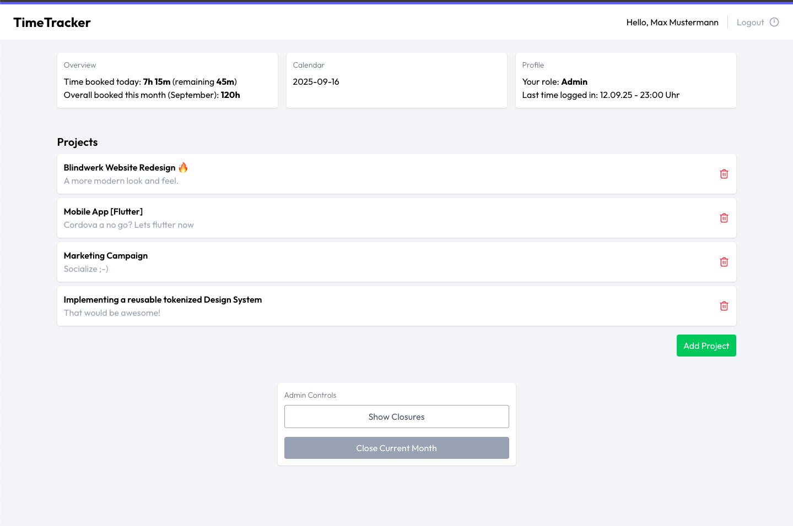

# TimeTracker

A time tracking application built with **Laravel 12**, **Vue 3**, **TypeScript**, **Tailwind CSS**, **Pinia**, and **Axios**.  
Designed for internal use by teams to track working hours on projects, manage entries, and perform monthly closures.



---

## Table of Contents

- [Features](#features)
- [Tech Stack](#tech-stack)
- [Installation](#installation)
- [Configuration](#configuration)
- [Usage](#usage)
- [Authentication & Roles](#authentication--roles)
- [Testing](#testing)
- [Project Architecture](#project-architecture)
- [Versioning & Changelog](#versioning--changelog)
- [TODO / Planned Features](#todo--planned-features)
- [Author & Rights](#author--rights)
- [License](#license)

---

## Features

- Create and manage **projects**
- Book work time in **15-minute increments**  
  - Input formats: `"Xh Ym"` or decimal hours (e.g., `0.25`)  
- Assign entries to specific **days**
- Edit and delete your own entries
- **Monthly closure**  
  - Summarizes hours per project/user  
  - Locks entries after closure
- **Roles and permissions**
  - Admin: can create/delete projects, perform monthly closure  
  - Employee: can only manage own entries

---

## Tech Stack

- **Backend:** Laravel 12 (PHP 8+)
- **Frontend:** Vue 3 + TypeScript + Vite
- **State Management:** Pinia
- **Styling:** Tailwind CSS
- **HTTP Client:** Axios
- **Database:** SQLite (default for demo/testing)
- **Testing:** PHPUnit (Unit & Feature tests)

---

## Installation

### 1. Clone the repository:
```
git clone https://github.com/oliverborner/time-tracker
cd time-tracker
```

### 2. Install PHP dependencies:
```
composer install
```

### 3. Install Node dependencies:
```
npm install
```

### 4. Copy .env and generate app key:
```
cp .env.example .env
php artisan key:generate
```

### 5. Run database migrations:
```
php artisan migrate --seed
```

### 6. Compile frontend assets:

(on first setup run npm run build, to generate the manifest.json)
```
npm run dev
```

### 7. Serve Laravel backend:
```
php artisan serve
```

Visit http://localhost:8000 to see the app.


## Usage

- Login as test users:

    Admin: 

    ``` admin@example.com / password ```

    Employee: 

    ``` employee@example.com / password ```

- Navigate to Dashboard to manage projects 
- Perform monthly closure if logged in as admin


## Authentication & Roles

- Admin
    - Create/delete projects
    - Perform monthly closures
    - Manage all time entries

- Employee
    - Can only create/edit/delete own time entries
    - Cannot delete projects or perform closures


## Testing

- Run unit and feature tests:
```
php artisan test
```

- Unit tests: policies, models // TODO
- Feature tests: API endpoints, authentication, role permissions
- Test Typscript: npx vue-tsc --noEmit


## Versioning & Changelog

- See CHANGELOG.md for details of releases


## TODO / Planned Features

- **Frontend Testing:**  
  - Integrate **Jest** + Vue Testing Library for unit and component tests
- **Team Management:**  
  - Assign users to teams 
  - Manage team-based permissions and reports
- **Advanced Reporting:**  
  - Generate PDF or Excel reports for projects and time entries  
  - Dashboard charts and analytics
- **Notifications & Reminders:**  
  - Email or in-app notifications for missing time entries or monthly closures
- **Recurring Time Entries:**  
  - Allow employees to create recurring or template-based entries
- **Multi-Language Support:**  
  - Add localization (i18n) for multiple languages (German)
- **Dark Mode / UI Enhancements:**  
  - Improve UI/UX with themes, responsive design, and accessibility improvements
- **WCAG & Accessibility:**  
  - Ensure full accessibility compliance (keyboard navigation, screen readers, contrast ratios)
- **Lazy Loading:**  
  - Optimize performance by lazy-loading components and routes
- **Security Features:**  
  - Enhance authentication and authorization  
  - Input validation, rate limiting, CSRF/XSS protection


## Author & Rights

**Developer & Architect:** Oliver Borner

All code, design, and intellectual property in this project are created and owned by Oliver Borner.  
Unauthorized use, reproduction, or distribution without permission is prohibited.  

For collaboration, licensing, or inquiries, please contact: oliverborner@gmail.com

## License

This project is licensed under the MIT License.